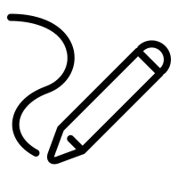
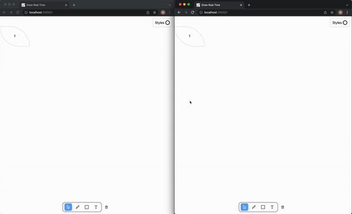

<h1 align="center">
  <p>Draw Real Time</p>
</h1>
<a href="https://drawrt.vercel.app/"><p align="center"></p></a>



# Draw real time
- A little real-time online collaborative drawing program. <https://drawrt.vercel.app>
- Web Draw Real Time is a web app that allows users to draw on a shared canvas in real time.
# Setup project
## Run project local.
- Install the [Nodejs](https://nodejs.org/en/download/)
- Clone the project: `https://github.com/hoangminh981/draw-real-time`
- Cd to client: 
```
cd ./client
npm install
npm start
```
- Cd to server: 
```
cd ./server
npm install
npm start
```
# Start project
## How does it work?
Web Draw Real Time uses *sessions*, which connect users together.
All users in a session work on the same canvas.
Web Draw Real Time uses WebSockets for the "Web" part, and the web Canvas API for the "Draw" part.
The WebSockets server uses the ws module for Node.js.When a user performs an action, the server is told about it and tells all other session members about it.

## Currently available tools
- Select `Keypress 1`
- Pen Tool `Keypress 2`
- Rectangle Tool `Keypress 3`
- Ellipse Tool `Keypress 4`
- Line Tool `Keypress 5`
- Text Editing `Keypress 6`
- Pan Tool `Alt/Option`
- Zoom Tool `Scroll`
- Colour Picker Tool

# Upcoming features
- [ ] Undo/Redo
- [ ] EraseBrush
